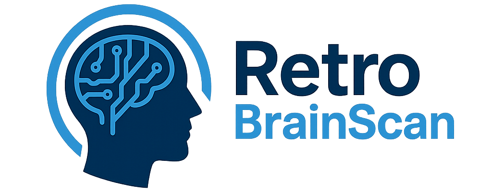

# RetroBrainScan  

  

### Devpost Submission <a href="https://devpost.com/software/retrobrainscan"><i>here!</i></a>

### Slides <a href="https://docs.google.com/presentation/d/1fcUcFQXCS8xvzqH7oq9jAMzO5LSLlapZQSdbB-zEoXM/edit?slide=id.p#slide=id.p"><i>here!</i></a>

## How to run:
1) Clone the repository
2) Navigate to the Flask_Backend directory and run `python install_and_run.py` to set up the virtual environment and start the Flask server.
3) Navigate to the React_Frontend directory and run `npm install` to install the dependencies, then run `npm run dev` to start the React development server.
4) Open your browser and go to url that the frontend is running on (usually http://localhost:5173/) to see the application in action.

## Inspiration

Our inspiration came from personal experiences watching family members live with, and sometimes lose their lives to, dementia. We wanted to build a tool that helps families understand what’s coming, prepare earlier, and feel less alone in the process.

## What it does

RetroBrainScan bridges retro medical imaging with modern AI to transform dementia care. Using a specialized LLM trained on longitudinal brain-scan data, we analyze a patient’s current neurological state and generate a scientifically grounded 5-year degeneration forecast. Our system produces side-by-side visual reports, including heat-map projections that highlight regions most at risk of decline.

But we don’t stop at prediction, RetroBrainScan turns insights into action. Based on projected deterioration patterns, the platform generates a personalized care plan for patients and caregivers, offering guidance on daily functioning, safety, cognitive support, and long-term planning.

By combining retro diagnostics and modern AI, RetroBrainScan helps families and clinicians see the future, prepare earlier, and improve quality of life for those affected by dementia.

## How we built it

We trained our LLM model using pytorch/torchvision and MRI datasets from OASIS-1 and additional publicly available brain-scan sets. The MRI images are processed through our custom LLM pipeline, which predicts a 5-year degeneration trajectory and generates a heat-mapped future MRI.

We built a custom-trained ResNet18 classifier to predict Alzheimer’s severity and paired it with a convolutional autoencoder that learns structural representations from brain MRIs. Using the autoencoder’s latent space, we modeled a progression vector that simulates the shift from “No Impairment” to “Moderate Impairment,” enabling the generation of synthetic MRI projections five years into the future. To ensure transparency, we incorporated Grad-CAM explainability to highlight the specific brain regions driving each prediction.

We built a React frontend for easy MRI upload and visualization. A Python Flask backend handles image processing, model inference, and communication with a SQLite database for storing scans and results.

After the predicted MRI and heat map are generated, we use the Gemini API to create a comprehensive report that summarizes the current condition, projected changes, and a personalized care plan for both the patient and caregiver.

## Challenges we ran into

Access to high-quality dementia datasets was limited, making it difficult to train and validate our model. We had to rely on fragmented, small, or non-specialized MRI datasets and adjust our pipeline to work with the available data. Several of our initial modeling approaches including a VAE-based generator and early progression pipelines had to be discarded due to insufficient clarity or instability in their outputs. This required redesigning our architecture and developing a more reliable latent-space progression framework tailored to the constraints of the available data.

## Accomplishments that we're proud of

We successfully built an end-to-end system that ingests MRI scans, predicts a 5-year brain degeneration trajectory, generates heat-map visuals, and produces an AI-driven care report. We’re proud that we combined retro and multiple modern technologies, such as LLMs, medical imaging, Flask, React, and Gemini into a functioning prototype that demonstrates real-world impact for dementia care

## What we learned

We learned how difficult it is to work with limited and highly specialized medical datasets, and how to adapt models to imperfect data. We gained experience integrating computer vision with LLMs, building a full-stack workflow for medical imaging, and designing tools that balance technical accuracy with caregiver usability.

## What's next for RetroBrainScan

Next, we plan to improve our model using larger longitudinal datasets, refine the heat-map prediction accuracy, and enhance the care-planning engine with more clinically validated guidance. We also aim to build a clinician dashboard, support additional neurodegenerative conditions, and explore partnerships with medical researchers to bring RetroBrainScan closer to real-world deployment.
